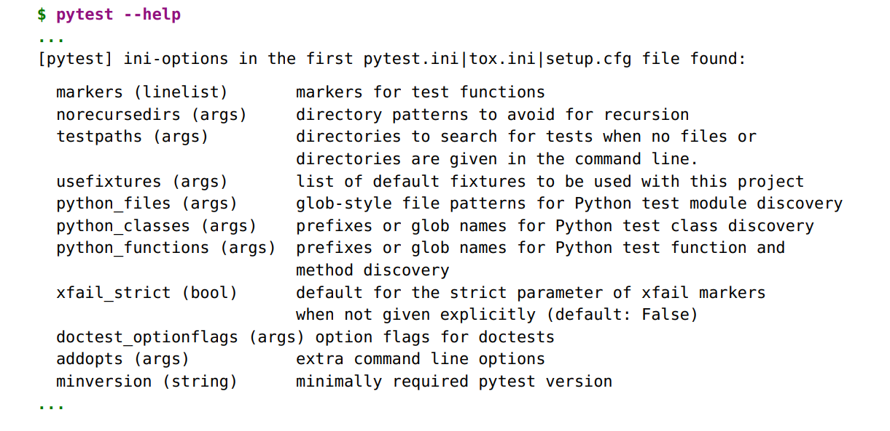

## Configuration

So far in this course, I’ve talked about the various non-test files that affect
pytest mostly in passing, with the exception of conftest.py, which I covered quite
thoroughly in Lab 5, Plugins In this lab, we’ll take a
look at the configuration files that affect pytest, discuss how pytest changes
its behavior based on them, and make some changes to the configuration
files of the Tasks project.

#### Pre-reqs:
- Google Chrome (Recommended)

#### Lab Environment
Al labs are ready to run. All packages have been installed. There is no requirement for any setup.

All exercises are present in `~/work/testing-with-pytest/code` folder.


### Understanding pytest Configuration Files

Before I discuss how you can alter pytest’s default behavior, let’s run down
all of the non-test files in pytest and specifically who should care about them.
Everyone should know about these:

- _pytest.ini_ : This is the primary pytest configuration file that allows you to
    change default behavior. Since there are quite a few configuration changes
    you can make, a big chunk of this lab is about the settings you can
    make in pytest.ini.

- _conftest.py_ : This is a local plugin to allow hook functions and fixtures for
    the directory where the conftest.py file exists and all subdirectories. conftest.py
    files are covered Lab 5, Plugins

- ___init__.py_ : When put into every test subdirectory, this file allows you to
    have identical test filenames in multiple test directories. We’ll look at an
    example of what can go wrong without __init__.py files in test directories in
    Avoiding Filename Collisions

If you use tox, you’ll be interested in:

- _tox.ini_ : This file is similar to pytest.ini, but for tox. However, you can put your
    pytest configuration here instead of having both a tox.ini and a pytest.ini file,


saving you one configuration file. Tox is covered in Lab 7, Using pytest
with Other Tools

If you want to distribute a Python package (like Tasks), this file will be of

interest:

- _setup.cfg_ : This is a file that’s also in ini file format and affects the behavior
    of setup.py. It’s possible to add a couple of lines to setup.py to allow you to
    run pythonsetup.pytest and have it run all of your pytest tests. If you are
    distributing a package, you may already have a setup.cfg file, and you can
    use that file to store pytest configuration. You’ll see how in Appendix 4,
    Packaging and Distributing Python Projects

Regardless of which file you put your pytest configuration in, the format will
mostly be the same.

For pytest.ini:

```
ch6/format/pytest.ini

[pytest]
addopts = -rsxX -l --tb=short --strict
xfail_strict = true
;... more options ...
```

For tox.ini:

```

ch6/format/tox.ini**

;... tox specific stuff ...

[pytest]
addopts = -rsxX -l --tb=short --strict
xfail_strict = true
;... more options ...
```

For setup.cfg:

```
ch6/format/setup.cfg**

;... packaging specific stuff ...

[tool:pytest]
addopts = -rsxX -l --tb=short --strict
xfail_strict = true
;... more options ...
```

The only difference is that the section header for setup.cfg is [tool:pytest] instead
of [pytest].

**List the Valid ini-file Options with pytest –help**

You can get a list of all the valid settings for pytest.ini from pytest --help. This is
a sampling:


```
$ pytest --help
```




You’ll look at all of these settings in this lab, except doctest_optionflags, which is covered in Lab 7, Using pytest with Other Tools

**Plugins Can Add ini-file Options**

The previous settings list is not a constant. It is possible for plugins (and
conftest.py files) to add ini file options. The added options will be added to the
pytest --help output as well.

Now, let’s explore some of the configuration changes we can make with the
builtin ini file settings available from core pytest.

### Changing the Default Command-Line Options

You’ve used a lot of command-line options for pytest so far, like -v/--verbose
for verbose output and -l/--showlocals to see local variables with the stack trace
for failed tests. You may find yourself always using some of those options—or
preferring to use them—for a project. If you set addopts in pytest.ini to the options
you want, you don’t have to type them in anymore. Here’s a set I like:

```
[pytest]
addopts= _-rsxX-l --tb=short--strict_
```

The -rsxX tells pytest to report the reasons for all tests that skipped, xfailed,  or
xpassed. The -l tells pytest to report the local variables for every failure with
the stacktrace. The --tb=short removes a lot of the stack trace. It leaves the file
and line number, though. The --strict option disallows markers to be used if they
aren’t registered in a config file. You’ll see how to do that in the next section.


### Registering Markers to Avoid Marker Typos

Custom markers, as discussed in Marking Test Functions, are
great for allowing you to mark a subset of tests to run with a specific marker.
However, it’s too easy to misspell a marker and end up having some tests
marked with @pytest.mark.smoke and some marked with @pytest.mark.somke. By
default, this isn’t an error. pytest just thinks you created two markers. This
can be fixed, however, by registering markers in pytest.ini, like this:

```
[pytest]
markers =
    smoke: Run the smoke test functions for tasks project
    get: Run the test functions that test tasks.get()

With these markers registered, you can now also see them with pytest --markers
with their descriptions:

$ cd /home/jovyan/work/testing-with-pytest/code/ch6/b/tasks_proj/tests
$ pytest --markers

@pytest.mark.smoke: Run the smoke test test functions

@pytest.mark.get: Run the test functions that test tasks.get()

...

@pytest.mark.skip(reason=None): skip the ...

...

```

If markers aren’t registered, they won’t show up in the --markers list. With them
registered, they show up in the list, and if you use --strict, any misspelled or
unregistered markers show up as an error. The only difference between
ch6/a/tasks_proj and ch6/b/tasks_proj is the contents of the pytest.ini file. It’s empty
in ch6/a. Let’s try running the tests without registering any markers:

```
$ cd /home/jovyan/work/testing-with-pytest/code/ch6/a/tasks_proj/tests
$ pytest --strict --tb=line


=================== test session starts ===================
plugins: cov-2.5.1
collected 45 items / 2 errors
========================= ERRORS ==========================
____________ ERROR collecting func/test_add.py ____________
func/test_add.py:20: in <module>
@pytest.mark.smoke
...
E AttributeError: 'smoke' not a registered marker
______ ERROR collecting func/test_api_exceptions.py _______
func/test_api_exceptions.py:30: in <module>
@pytest.mark.smoke
...

E AttributeError: 'smoke' not a registered marker
!!!!!!!!! Interrupted: 2 errors during collection !!!!!!!!!
================= 2 error in 0.29 seconds =================

```


If you use markers in pytest.ini to register your markers, you may as well add
--strict to your addopts while you’re at it. You’ll thank me later. Let’s go ahead
and add a pytest.ini file to the tasks project:

```
ch6/b/tasks_proj/tests/pytest.ini

[pytest]
addopts = -rsxX -l --tb=short --strict
markers = 
  smoke: Run the smoke test test functions
  get: Run the test functions that test tasks.get()
```

This has a combination of flags I prefer over the defaults: -rsxX to report which
tests skipped, xfailed,  or xpassed, --tb=short for a shorter traceback for failures,
and --strict to only allow declared markers. And then a list of markers to allow
for the project.

This should allow us to run tests, including the smoke tests:

```
$ cd /home/jovyan/work/testing-with-pytest/code/ch6/b/tasks_proj/tests
$ pytest --strict -m smoke

=================== test session starts ===================
plugins: cov-2.5.1
collected 57 items / 54 deselected
func/test_add.py . [ 33%]
func/test_api_exceptions.py .. [100%]
========= 3 passed, 54 deselected in 0.13 seconds =========
```

### Requiring a Minimum pytest Version

The minversion setting enables you to specify a minimum pytest version you
expect for your tests. For instance, I like to use approx() when testing floating
point numbers for “close enough” equality in tests. But this feature didn’t get
introduced into pytest until version 3.0. To avoid confusion, I add the following
to projects that use approx():

```
[pytest]
minversion= 3.0
```

This way, if someone tries to run the tests using an older version of pytest,
an error message appears.


### Stopping pytest from Looking in the Wrong Places

Did you know that one of the definitions of “recurse” is to swear at your code
twice? Well, no. But, it does mean to traverse subdirectories. In the case of
pytest, test discovery traverses many directories recursively. But there are
some directories you just know you don’t want pytest looking in.

The default setting for norecurse is '.* build dist CVS _darcs {arch} and *.egg. Having '.*'
is a good reason to name your virtual environment '.venv', because all directo-
ries starting with a dot will not be traversed. However, I have a habit of
naming it venv, so I could add that to norecursedirs.

In the case of the Tasks project, you could list src in there also, because having
pytest look for test files there would just be a waste of time.

```
[pytest]
norecursedirs = .* venv src *.egg dist build
```

When overriding a setting that already has a useful value, like this setting,
it’s a good idea to know what the defaults are and put the ones back you care
about, as I did in the previous code with *.egg dist build.

The norecursedirs is kind of a corollary to testpaths, so let’s look at that next.

### Specifying Test Directory Locations

Whereas norecursedirs tells pytest where not to look, testpaths tells pytest where
to look. testspaths is a list of directories relative to the root directory to look in
for tests. It’s only used if a directory, file, or nodeid is not given as an argument.

Suppose for the Tasks project we put pytest.ini in the tasks_proj directory instead
of under tests:

```
tasks_proj/
├──pytest.ini
├──src
│ └──tasks
│ ├──api.py
│ └──...
└──tests
├──conftest.py
├──func
│ ├──__init__.py
│ ├──test_add.py
│ ├──...
└──unit
├──__init__.py
├──test_task.py


#### └──...
```

It could then make sense to put tests in testpaths:

```
[pytest]
testpaths= tests
```

Now, as long as you start pytest from the tasks_proj directory, pytest will only
look in tasks_proj/tests. My problem with this is that I often bounce around a
test directory during test development and debugging, so I can easily test a
subdirectory or file without typing out the whole path. Therefore, for me, this
setting doesn’t help much with interactive testing.

However, it’s great for tests launched from a continuous integration server
or from tox. In those cases, you know that the root directory is going to be
fixed, and you can list directories relative to that fixed root. These are also
the cases where you really want to squeeze your test times, so shaving a bit
off of test discovery is awesome.

At first glance, it might seem silly to use both testpaths and norecursedirs at the
same time. However, as you’ve seen, testspaths doesn’t help much with interac-
tive testing from different parts of the file system. In those cases, norecursedirs
can help. Also, if you have directories with tests that don’t contain tests, you
could use norecursedirs to avoid those. But really, what would be the point of
putting extra directories in tests that don’t have tests?

### Changing Test Discovery Rules

pytest finds tests to run based on certain test discovery rules. The standard

test discovery rules are:

- Start at one or more directory. You can specify filenames or directory
    names on the command line. If you don’t specify anything, the current
    directory is used.

- Look in the directory and all subdirectories recursively for test modules.

- A test module is a file with a name that looks like test_*.py or *_test.py.

- Look in test modules for functions that start with test_.

- Look for classes that start with Test. Look for methods in those classes
    that start with test_ but don’t have an __init__ method.

These are the standard discovery rules; however, you can change them.


**python_classes**

The usual test discovery rule for pytest and classes is to consider a class a
potential test class if it starts with Test*. The class also can’t have an __init__()
function. But what if we want to name our test classes <something>Test or
<something>Suite? That’s where python_classes comes in:

```
[pytest]
python_classes= _*TestTest**Suite_
```


```
**class** DeleteSuite():
def test_delete_1 ():
...
def test_delete_2 ():
...
....
```


**python_files**

Like pytest_classes, python_files modifies the default test discovery rule, which is
to look for files that start with test_* or end in *_test.

Let’s say you have a custom test framework in which you named all of your
test files check_<something>.py. Seems reasonable. Instead of renaming all of
your files, just add a line to pytest.ini like this:

```
[pytest]
python_files= _test_**_testcheck_*_
```

Easy peasy. Now you can migrate your naming convention gradually if you
want to, or just leave it as check_*.

**python_functions**

python_functions acts like the previous two settings, but for test function and
method names. The default is test_*. To add check_*—you guessed it—do this:

```
[pytest]
python_functions= _test_*check_*_
```

Now the pytest naming conventions don’t seem that restrictive, do they? If you
don’t like the default naming convention, just change it. However, I encourage
you to have a better reason. Migrating hundreds of test files is definitely a
good reason.

### Disallowing XPASS

Setting xfail_strict= true causes tests marked with @pytest.mark.xfail that don’t fail to
be reported as an error. I think this should always be set. For more information
on the xfail marker, go to Marking Tests as Expecting to Fail

### Avoiding Filename Collisions

The utility of having __init__.py files in every test subdirectory of a project con-
fused me for a long time. However, the difference between having these and


not having these is simple. If you have __init__.py files in all of your test subdi-
rectories, you can have the same test filename show up in multiple directories.
If you don’t, you can’t. That’s it. That’s the effect on you.

Here’s an example. Directory a and b both have the file, test_foo.py. It doesn’t
matter what these files have in them, but for this example, they look like this:

```
ch6/dups/a/test_foo.py

def test_a():
    pass
```

```
ch6/dups/b/test_foo.py

def test_b():
    pass
```

With a directory structure like this:

```
dups
├──a
│ └──test_foo.py
└──b
└──test_foo.py
```

These files don’t even have the same content, but it’s still mucked up. Run-
ning them individually will be fine, but running pytest from the dups directory
won’t work:

```
$ cd /home/jovyan/work/testing-with-pytest/code/ch6/dups
$ pytest a

=================== test session starts ===================
plugins:cov-2.5.1
collected1 item

a/test_foo.py. [100%]

================ 1 passed in 0.01 seconds =================
$ pytest b

=================== test session starts ===================
plugins:cov-2.5.1
collected1 item

b/test_foo.py. [100%]

================ 1 passed in 0.01 seconds =================
$ pytest

=================== test session starts ===================
plugins:cov-2.5.1
collected1 item/ 1 errors

=========================ERRORS==========================
_____________ERRORcollectingb/test_foo.py______________
importfilemismatch:
importedmodule'test_foo'has this__file__attribute:
```

```
/home/jovyan/work/testing-with-pytest/code/ch6/dups/a/test_foo.py
whichis not the sameas the testfilewe wantto collect:
/home/jovyan/work/testing-with-pytest/code/ch6/dups/b/test_foo.py
HINT:remove__pycache__/ .pycfiles
and/oruse a uniquebasename for yourtestfilemodules
!!!!!!!!!Interrupted:1 errorsduringcollection!!!!!!!!!

================= 1 error in 0.15 seconds =================
```

That error message highlights that we have two files named the same, but
doesn’t tell us how to fix it.

To fix this test, just add empty __init__.py files in the subdirectories. Here, the
example directory dups_fixed is the same as dups, but with __init__.py files added:

```
dups_fixed/
├──a
│ ├──__init__.py
│ └──test_foo.py
└──b
├──__init__.py
└──test_foo.py
```

Now, let’s try this again from the top level in dups_fixed:

```
$ cd /home/jovyan/work/testing-with-pytest/code/ch6/dups_fixed
$ pytest

=================== test session starts ===================
plugins:cov-2.5.1
collected2 items

a/test_foo.py. [ 50%]
b/test_foo.py. [100%]

================ 2 passed in 0.03 seconds =================
```

There, all better. You might say to yourself that you’ll never have duplicate
filenames, so it doesn’t matter. That’s fine. But projects grow and test direc-
tories grow, and do you really want to wait until it happens to you before you
fix it? I say just put those files in there as a habit and don’t worry about it
again.

### Exercises

In Lab 5, Plugins, you created a plugin called pytest-nice that
included a --nice command-line option. Let’s extend that to include a pytest.ini
option called nice.

1. Add the following line to the pytest_addoption hook function in pytest_nice.py:

```
parser.addini('nice',type='bool',help='Turn failures into opportunities.')
```

2. The places in the plugin that use getoption() will have to also call getini('nice').
Make those changes.

3. Manually test this by adding nice to a pytest.ini file.

4. Don’t forget the plugin tests. Add a test to verify that the setting ‘nice’
from pytest.ini works correctly.

5. Add the tests to the plugin tests directory. You’ll need to look up some
extra pytester functionality.

### What’s Next

While pytest is extremely powerful on its own—especially so with plugins—it
also integrates well with other software development and software testing
tools. In the next lab, you’ll look at using pytest in conjunction with
other powerful testing tools.

1. https://docs.pytest.org/en/latest/_modules/_pytest/pytester.html#Testdir

